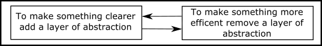

### What i do

- ✨ make random stuff
- 👯 pair programming
- 🔥 tdd
- 💘 functional programming lover
- 🌿 learn useless programming languages from [rosetta](https://rosettacode.org/wiki/FizzBuzz)
- 💣 open-minded about DevOps and Cloud
- 🌇 horizontal in front-end related stuff, i’m a very bad at graphics D:

💕 Kotlin 💕 Haskell 💕 Elixir 💕 Rust 

daily fight: 🤦 Hype cycle 🤯 Overchoice 😳 impostor syndrome 😵 Information overload... and
<a src="https://www.youtube.com/watch?v=lKXe3HUG2l4&t=1372">

<a/>
  
and more:
```
"Misunderstandings and lethargy perhaps produce more wrong in the world than deceit and malice do. At least the latter two are certainly rarer." -Hanlon's razor
```
<!--
**AngeloChecked/AngeloChecked** is a ✨ _special_ ✨ repository because its `README.md` (this file) appears on your GitHub profile.

Here are some ideas to get you started:

- 🔭 I’m currently working on ...
- 🌱 I’m currently learning ...
- 👯 I’m looking to collaborate on ...
- 🤔 I’m looking for help with ...
- 💬 Ask me about ...
- 📫 How to reach me: ...
- 😄 Pronouns: ...
- ⚡ Fun fact: ...
-->
